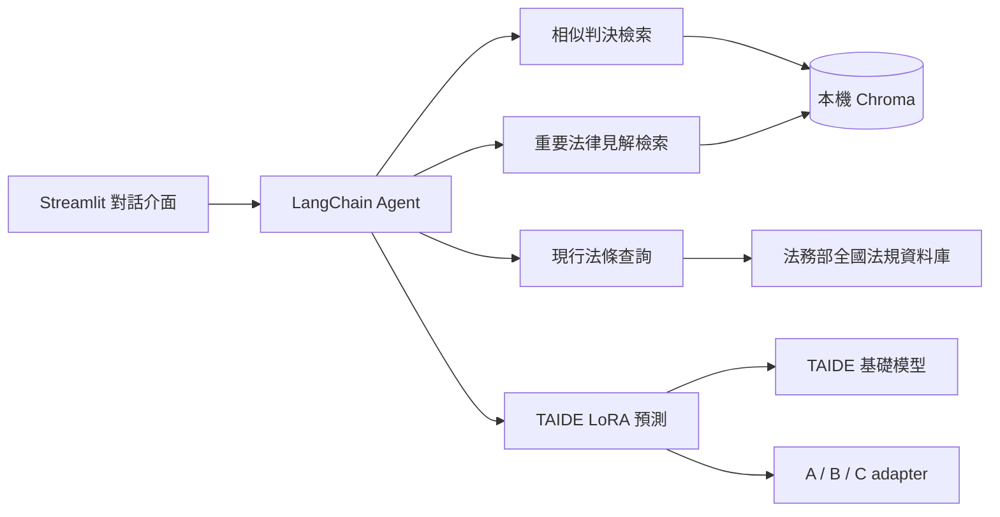
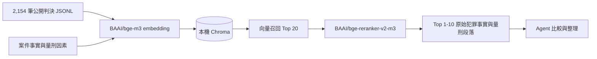

# 公然侮辱案件研究與量刑輔助 Agent

這是一個面向臺灣刑事公然侮辱案件的研究型 AI Agent。系統將相似判決檢索、
現行法條查詢、重要法律見解檢索，以及 TAIDE LoRA 刑種與刑度群組預測整合在
同一個 Streamlit 對話介面中，並明確區分法律來源原文、模型預測與生成式 AI 分析。

> 本專案僅供法律研究與作品展示，不構成法律意見、訴訟策略或法院判決保證。

## 主要能力

- **相似判決檢索**：以 `BAAI/bge-m3` embedding 召回候選判決，再以
  `BAAI/bge-reranker-v2-m3` cross-encoder 重排；使用者可在提示中指定 1 至 10 筆結果。
- **法律來源查詢**：查詢現行刑法條文，並檢索已人工核對的重要法院見解與解釋。
- **量刑輔助預測**：依案件資訊動態選擇 TAIDE + A／B／C LoRA adapter，預測
  刑種、刑度群組並生成繁體中文量刑理由。
- **完整案件分析**：由 Agent 自行選擇所需工具，整理有利因素、不利因素、相似處、
  差異與模型限制。

## 系統架構

### 高階元件



### 相似判決 RAG 流程



`BAAI/bge-reranker-v2-m3` 透過 `FlagEmbedding` 套件載入；前者是模型名稱，後者是
推論套件。Chroma 是可重建的本機快取，首次查詢會依公開判決資料建立索引。

## Agent 工程設計

### 模型分工與動態路由

| 執行階段 | 預設模型 | 責任 |
| --- | --- | --- |
| 意圖辨識與工具路由 | `gpt-5.4-nano` | 理解使用者需求、選擇工具並產生結構化工具參數 |
| 高成本工具結果整理 | `gpt-5.4-mini` | 整理相似判決、重要見解與 TAIDE 預測結果，生成最終回答 |
| 模型錯誤備援 | `gpt-5.4` | 前述模型在重試後仍失敗時接手請求 |
| 本機量刑研究 | `taide/Llama-3.1-TAIDE-LX-8B-Chat` | 共用基礎模型並依輸入完整度切換 A／B／C LoRA adapter |

上述 OpenAI 模型均可透過 `.env` 覆寫。這裡的「動態工具選擇」是指
`gpt-5.4-nano` 根據每次請求，從相似判決、重要見解、刑法條文及量刑研究模型四項工具
中選擇所需能力；middleware 則負責執行期工具管控，不取代模型的第一次工具選擇。

### TAIDE LoRA 動態選擇

法院、裁判年份與法官姓名不是訴前預測的必填欄位。系統只使用使用者確實提供的
制度資訊，不會猜測缺漏值：

| 可用資訊 | Adapter | 使用情境 |
| --- | --- | --- |
| 犯罪事實、量刑因素 | A | 訴前或法院尚未確定 |
| A + 法院、裁判年份 | B | 已知法院與預計裁判年份 |
| B + 承審法官 | C | 已分案且法官姓名已知 |

三個 adapter 共用同一份 TAIDE 基礎模型，執行期間只切換 PEFT adapter，避免保存或
同時載入三份完整 8B 模型。Adapter 發布於 Hugging Face：
[A](https://huggingface.co/a97141481/Llama-3.1-TAIDE-Public-Insult-A-LoRA)、
[B](https://huggingface.co/a97141481/Llama-3.1-TAIDE-Public-Insult-B-LoRA)、
[C](https://huggingface.co/a97141481/Llama-3.1-TAIDE-Public-Insult-C-LoRA)。

### Middleware 與可靠性控制

| Middleware | 本專案中的用途 |
| --- | --- |
| `SingleUseToolMiddleware`（自訂） | 高成本工具執行後，在同一個使用者請求的後續模型呼叫中隱藏該工具，並切換至 `gpt-5.4-mini` 整理結果；下一輪使用者請求會恢復完整工具清單 |
| `ToolCallLimitMiddleware` | 從執行層保證相似判決、重要見解與 TAIDE 預測在單次請求內各最多執行一次 |
| `ModelRetryMiddleware` | 模型呼叫失敗時採指數退避，最多重試兩次 |
| `ModelFallbackMiddleware` | 重試仍失敗時切換至 `gpt-5.4` |
| `ToolErrorMiddleware` | 將可預期的輸入、模型載入及網路錯誤轉成可安全呈現的訊息 |
| `ToolRetryMiddleware` | 法務部法條查詢遇到暫時性連線失敗時獨立重試 |

「隱藏工具」只會縮減該次模型請求收到的工具 schema，不會刪除 Python 工具或停用
後續對話。這套設計同時保留模型的動態工具選擇能力，並以確定性的執行防護
避免同一請求重複檢索、重複推論及無界成本。

### 多輪短期記憶與中止

每個 Streamlit 瀏覽器工作階段會建立獨立 `thread_id`，並由 LangGraph
`InMemorySaver` 保存該對話中的使用者訊息、模型回覆、工具呼叫與工具結果，因此後續
問題可沿用前文。
UI 另以 `st.session_state` 保存適合顯示的精簡對話；按下「清除」會建立新的
`thread_id`，避免舊 checkpoint 回流。checkpoint serializer 只允許本專案定義的結構化
輸出類型，縮小反序列化的信任邊界。

這是工作階段內的短期記憶，不是跨程序的長期記憶；Streamlit 伺服器重新啟動後不會
保留。停止按鈕則透過背景非同步串流與 runtime `cancellation_event` 將中止訊號傳遞至
Agent 及 TAIDE 推論，該執行狀態不會寫入對話 checkpoint。

核心實作可參考 [`app/agent/legal_agent.py`](app/agent/legal_agent.py)、
[`app/agent/middleware.py`](app/agent/middleware.py) 與
[`ui/agent_stream.py`](ui/agent_stream.py)。

## 快速開始

本專案已在 macOS、Python 3.13 測試。TAIDE 基礎模型是 gated repository，請先在
[模型頁面](https://huggingface.co/taide/Llama-3.1-TAIDE-LX-8B-Chat)
閱讀並同意條款。

```bash
python -m venv .venv
source .venv/bin/activate
pip install -r requirements.txt
cp .env.example .env
```

在 `.env` 填入：

```dotenv
OPENAI_API_KEY=your_openai_api_key
HF_TOKEN=your_huggingface_read_token
```

啟動介面：

```bash
streamlit run ui/streamlit_app.py
```

瀏覽器開啟 `http://localhost:8501`。首次使用相似判決或重要見解工具時，系統會下載
embedding／reranker 模型並從公開資料建立 Chroma 索引，因此會比後續查詢久。

若想在啟動介面前完成索引：

```bash
python scripts/ingest_judgments.py
python scripts/ingest_authorities.py
```

## 提示範例

```text
請根據以下案件搜尋 5 筆相似的公然侮辱判決，比較犯罪事實、量刑因素與判決結果；
並預測本案的刑種與刑度群組，說明使用的 A／B／C 版本與限制。

犯罪事實：被告在全家便利商店買香菸，因未滿十八歲遭到店員拒絕，竟惱羞成怒，
辱罵店員：「幹、幹你娘、幹你娘雞掰、耖你媽、你全家都死了」。

量刑因素：被告犯罪後矢口否認犯行，且未與告訴人和解。被告國中畢業、擺地攤賣
餅乾、月收入 24,000 元、經濟狀況勉持、需扶養一個女兒。被告有多項公然侮辱前科。
```

首頁另提供「搜尋相似判決」、「查詢法條與見解」、「預測刑種與刑度群組」及
「完整案件分析」四種可編輯提示草稿。

## 資料與模型

- `data/public/public_insult_judgments.jsonl`：2,154 筆司法院公開版判決，涵蓋
  臺北、新北、士林地方法院，裁判年份為民國 104 至 114 年。
- `data/public/public_insult_authorities.csv`：24 筆人工核對的重要法律見解。
- `data/vector_store/`：首次執行時建立的本機快取，不納入 Git。
- 原始工作試算表、SFT train／validation／test、checkpoint、adapter 與評估輸出均不
  納入此儲存庫。

判決資料的來源、處理方式、原文保留政策、異動與下架流程詳見
[DATA_SOURCES.md](DATA_SOURCES.md)。LoRA 訓練、消融實驗與離線評估詳見
[sft/README.md](sft/README.md)。

## 測試

執行 Agent 與資料處理測試：

```bash
python -B -m unittest discover -s tests -v
```

執行 SFT 資料、訓練流程與評估測試：

```bash
python -B -m unittest discover -s sft/tests -v
```

預設 SFT 測試不下載 8B 模型；需要 MPS 的小型整合測試必須另外設定
`SFT_RUN_MPS_SMOKE=1`。

## Agent 評估與追蹤

LangSmith 是選用的開發工具，不是執行 Streamlit Agent 的必要條件。`evals/` 提供
合成提示資料集與 deterministic code evaluators，用來檢查工具選擇、工具呼叫上限、
相似判決筆數、A／B／C 路由、回答格式及風險聲明。

```bash
pip install -r requirements-eval.txt
python evals/run_langsmith_evaluation.py --dry-run
```

要建立或更新遠端資料集，先在 `.env` 設定 `LANGSMITH_API_KEY`，再執行：

```bash
python evals/run_langsmith_evaluation.py --sync-only
python evals/run_langsmith_evaluation.py --split smoke
```

針對失敗案例做快速回歸測試時，可重複使用 `--case-id`，不需重跑整個分割：

```bash
python evals/run_langsmith_evaluation.py --split full \
  --case-id three_similar_judgments \
  --case-id ten_similar_judgments
```

`smoke` 只執行代表性案例；`full` 會執行全部案例，包含多次 RAG 與 TAIDE 推論，
需要較多時間與 API 成本。評估腳本會在該程序內啟用 tracing；一般 Agent 仍維持
預設關閉。LangSmith trace 會包含提示、工具參數、工具結果與模型回答，因此不得使用
真實委任案件或其他非公開資料。線上追蹤必須由使用者明確將
`LANGSMITH_TRACING` 設為 `true` 才會啟用。

### 已驗證基準

2026-10-02 以 suite `1.2`、`gpt-5.4-nano` 路由及 `gpt-5.4-mini` 整理，完成
11 筆合成案例的 full split。LangSmith 實驗名稱為
`legal-rag-agent-final-suite12-deb47f82`。本版評估器另會拒絕只有「研究模型預測」字樣的
弱風險提示，以及法律來源與 AI 分析順序顛倒的回答。

| 評估項目 | 通過結果 |
| --- | ---: |
| 回答格式契約 | 11 / 11 |
| 必要工具均有呼叫 | 11 / 11 |
| 禁用工具均未呼叫 | 11 / 11 |
| 高成本工具單輪上限 | 11 / 11 |
| 使用者指定判決筆數 | 3 / 3 |
| A／B／C 預測版本 | 5 / 5 |
| 研究用途與風險聲明 | 5 / 5 |
| 法律來源與 AI 分析分區 | 5 / 5 |

本輪 P50 延遲為 13.90 秒，範圍 1.02 至 46.60 秒；共使用 80,088 tokens，
LangSmith 記錄的 OpenAI API 成本為 0.100375 美元。延遲包含本機 TAIDE／RAG 模型載入、
向量檢索及保留判決原文的長篇回答，會隨硬體與快取狀態改變。測試提示皆為合成案件，
但 trace 仍可能包含工具取回的司法院公開裁判文字。

## 專案結構

```text
app/        Agent、工具、RAG、法條查詢與 TAIDE 推論
data/       可公開的執行期資料；向量索引在本機生成
evals/      LangSmith 合成案例、工具路由與回答契約評估
scripts/    資料建置、索引與人工檢查指令
sft/        LoRA 訓練、A/B/C 消融實驗與離線評估
tests/      Agent、RAG、資料契約與推論單元測試
ui/         Streamlit 介面與背景串流控制
```

## 已知限制

- 目前只針對特定法院、年份與公然侮辱有罪判決的資料分布進行研究，不應外推至其他
  罪名、法院或案件類型。
- 刑度輸出是資料驅動的群組分類，不是確切刑度；理由生成分數高也不代表刑度群組必然
  正確。
- 判決與法律可能在資料快照後異動；重要法律決策仍應核對官方最新來源。
- 執行 TAIDE 8B 需要足夠記憶體，CPU 推論可能較慢；OpenAI、Hugging Face 與官方
  法規網站也需要網路連線。

## 授權與來源

本專案由 [De-Cheng Hsieh](https://github.com/DE-CHENG-HSIEH) 自行開發的程式碼、
專案文件與專案自有 UI 素材採 [MIT License](LICENSE)。研究或技術文件若需引用本專案，
可使用 [`CITATION.cff`](CITATION.cff) 提供的資訊。

MIT License **不涵蓋**下列第三方內容：

- `data/public/` 中的司法院公開判決與法律見解，依司法院原始開放資料條款使用；
- TAIDE、Meta Llama 3.1、A／B／C LoRA adapters 與 BGE 模型權重；
- 執行期間下載的套件、模型，或由外部 API 與線上服務提供的內容。

資料範圍、處理方式、顯名及異動機制請見 [DATA_SOURCES.md](DATA_SOURCES.md) 與
[`data/public/README.md`](data/public/README.md)；模型、外部資料與服務的授權連結請見
[THIRD_PARTY_NOTICES.md](THIRD_PARTY_NOTICES.md)。本專案為獨立研究作品，不代表任何
法院、政府機關、模型提供者或服務商的認可或立場。
